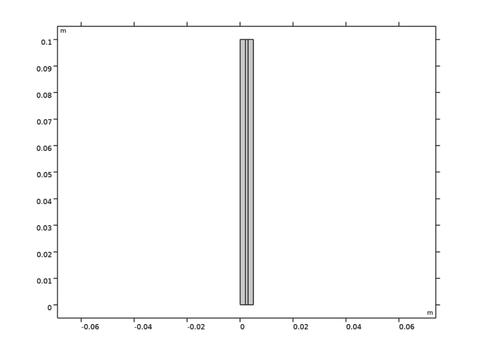
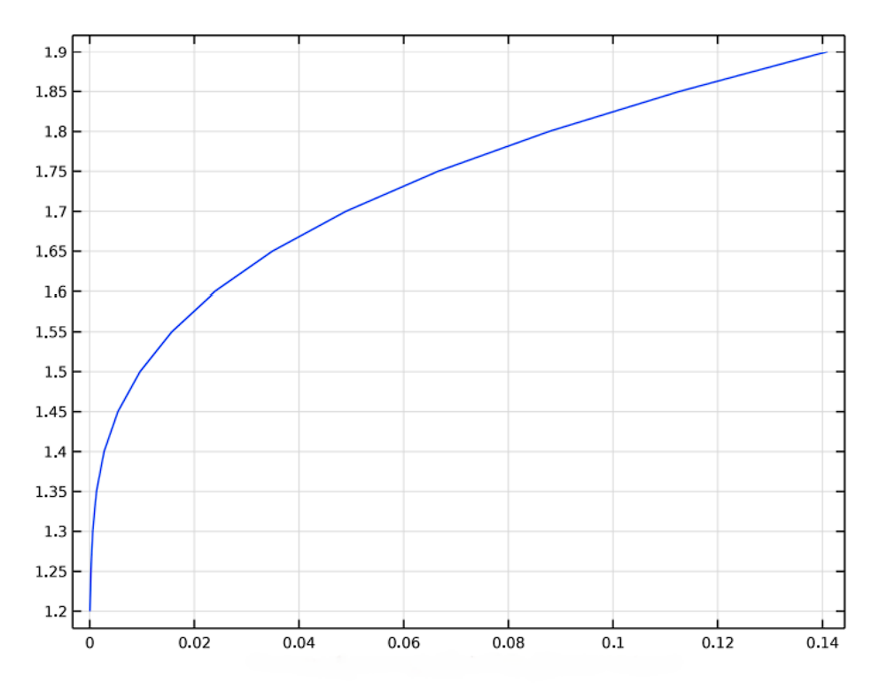

# COMSOL-Electrolysis-Cell-Simulation
## Simulation of a Pd-D₂O Electrolysis Cell

This repository contains the COMSOL Multiphysics simulation files for studying an electrolysis cell. The model was developed as part of an undergraduate project at **IIT Kanpur** under the mentorship of **Prof. Raj G.S. Pala**.

While the framework models general water ($H_2O$) electrolysis, it is specifically applied here to investigate the phenomenon of excess heat generation in a Palladium-Deuterium ($Pd-D_{2}O$) system, as first reported in the famous **Fleischmann & Pons 1989 experiment** [1]. The goal is to simulate the underlying electrochemical transport phenomena and provide a basis for studying the anomalous heat effects associated with "cold fusion."

---

## ⚛️ Background: The Fleischmann-Pons Experiment

On March 23rd, 1989, electrochemists Martin Fleischmann and Stanley Pons reported the generation of anomalous excess heat during the electrolysis of heavy water ($D_{2}O$) with a palladium (Pd) cathode. The magnitude of the energy released was far too large to be attributed to any known chemical process, leading them to hypothesize that a nuclear reaction was occurring within the palladium lattice at room temperature [1, 2]. This simulation aims to model the conditions of their experiment to better understand the physics involved.

---

## 🔬 Project Scope & Investigations

This project involved a detailed investigation into the electrochemical behavior of the cell. The key analyses performed include:

* **I-V Characteristic Analysis**: Generated and analyzed the current-voltage (I-V) polarization curves for the cell in a voltage range of **1.2 V to 1.9 V**.
* **Parametric Study**: Systematically investigated the effect of key design parameters on cell performance. The parameters studied were:
    * **Cathode Dimensions**
    * **Electrode Spacing**
    * **Electrolyte Concentration**
* **Performance Metrics**: The impact of the above parameters was evaluated based on the resulting **current density** and **enthalpy output**.

---

## 💻 COMSOL Multiphysics Simulation

The model is based on a Dewar-type Isoperibolic Calorimeter, which allows for accurate heat measurements [3]. The simulation was built using **stationary and time-dependent modules** and employed **fine mesh discretization** for accurate electrochemical transport modeling.

### Model Setup
* **Software**: COMSOL Multiphysics
* **Physics Module**: Water Electrolyzer

### Geometry
The simulation uses a 2D geometry representing the core components of the electrolysis cell:
* **Cathode (Pd) Width**: $0.2~cm$
* **Anode (Pt) Width**: $0.2~cm$
* **Separator Width**: $0.1~cm$
* **Electrode Height**: $10~cm$

> *Figure: Model geometry used in COMSOL, from left to right: Cathode, Separator, Anode.*

### Boundary and Initial Conditions
* **Initial Cell Voltage**: $1.2~V$
* **Operating Temperature**: $343~K$ ($70^\circ C$)
* **Electrolyte**: 6M KOH
* **Pressure**: $1~atm$

---

## 📊 Preliminary Results

A key result from the simulation is the polarization curve, which shows the relationship between cell voltage and the resulting current density. This is fundamental to understanding the cell's electrochemical efficiency and operational characteristics.

> *Figure: Cell Voltage ($E_{cell}$) vs. Current Density curve generated from the simulation.*

---

## 🤔 Future Research Directions

While this project covered extensive parametric analysis, the model can be extended to explore more fundamental questions about the anomalous heat phenomenon:

1.  What are the specific nuclear reactions and their energetics that could explain the excess heat? [5]
2.  What is the activation barrier for such reactions, and how might it be overcome within the palladium lattice?
3.  How do transient effects, such as the "heat bursts" reported by Fleischmann and Pons, manifest in the simulation? [1]

---

## 📚 References

[1] Fleischmann M., et al.: Calorimetry of the palladium-deuterium-heavy water system. *Electroanalytical Chemistry*, 1990.
[2] Miles, M. H., & Fleischmann, M.: Isoperibolic calorimetric measurements of the fleischmann-pons effect.
[3] Miles, M. H.: Fundamentals of isoperibolic calorimetric for cold fusion experiments.
[4] Miles, M. H.: Calorimetric studies of pd/d20+liod electrolysis cells. *Electroanalytical Chemistry*, 2000.
[5] Storms, E.: Science of low energy nuclear reactions. 2007.
